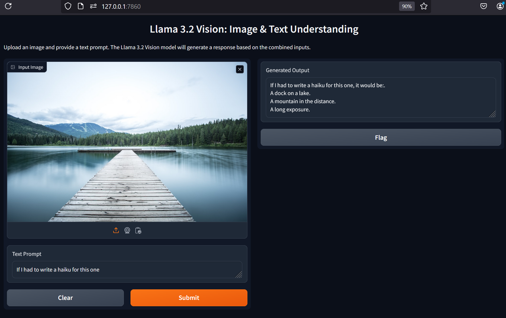

---

# Llama 3.2 Vision Model Gradio WebUI

<p align="center">
  
</p>

This project uses the Llama 3.2 Vision model to generate text responses based on image inputs and accompanying text prompts. It utilizes the Gradio library to create a user-friendly interface for interaction.

## Requirements

Make sure you have the following dependencies installed:

- `gradio`
- `torch`
- `Pillow`
- `transformers`
- `huggingface_hub`

You can install these dependencies using pip:

```bash
pip install gradio torch Pillow transformers huggingface_hub
```

## Getting Started

### Hugging Face Token

To use the model, you'll need a Hugging Face account and a token. Follow these steps:

1. Sign up for a Hugging Face account [here](https://huggingface.co/join).
2. Obtain your access token from [your settings](https://huggingface.co/settings/tokens).

### Setting Up the Project

1. Clone this repository:

    ```bash
    git clone https://github.com/spacewalk01/llama3.2-vision-webui.git
    cd llama3.2-vision-webui
    ```

### Running the Application

To run the Gradio interface, execute the following command, replacing `"Your_Hugging_Face_Token"` with your actual Hugging Face token:

```bash
python your_script_name.py --token Your_Hugging_Face_Token
```

Once the application starts, it will display a running local URL for the interactive demo.

### Interacting with the Application

This will launch a web interface where you can upload an image and provide a text prompt. The Llama 3.2 Vision model will generate a response based on the combined inputs.

## Usage

1. Upload an image.
2. Enter a text prompt.
3. Click "Submit" to receive a generated response based on the image and text.

## License

This project is licensed under the MIT License. See the [LICENSE](LICENSE) file for details.
