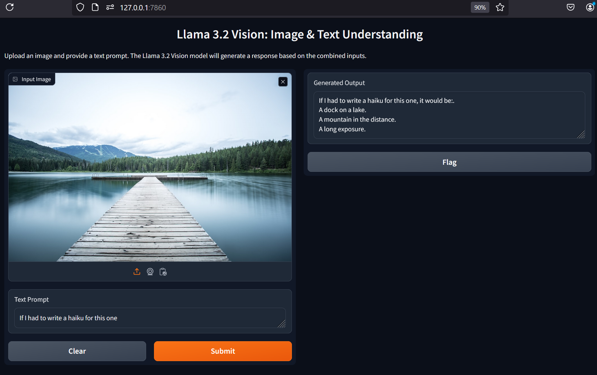

<h1 align="center">Gradio WebUI for Llama-3.2-Vision</h1>

<p align="center">
  
</p>

This project uses the Llama-3.2 Vision model to generate text responses from images and text prompts, with a user-friendly web ui interface built using Gradio.

## Getting Started

1. **Get a Hugging Face Token**  
   - Sign up for an account [here](https://huggingface.co/join).
   - Get a hugging token to access [llama3.2-11b-vision](https://huggingface.co/meta-llama/Llama-3.2-11B-Vision) model.

2. **Project Setup**  
   - Clone the repository:  
     ```bash
     git clone https://github.com/spacewalk01/llama3.2-vision-webui.git
     cd llama3.2-vision-webui
     ```
   - Install dependencies:  
     ```bash
     pip install -r requirements.txt
     ```

3. **Run the Application**  
   - Start the Gradio interface by running:  
     ```bash
     python main.py --token Your_Hugging_Face_Token
     ```  
   - Access the local URL to upload images and prompts, and view the Llama 3.2 Vision model's responses.

## License

This project is licensed under the MIT License. See the [LICENSE](LICENSE) file for details.

## References

1. [Llama 2.3 technical overview](https://ai.meta.com/blog/llama-3-2-connect-2024-vision-edge-mobile-devices/)
2. [Huggingface Model](https://huggingface.co/meta-llama/Llama-3.2-11B-Vision)
3. [Gradio](https://www.gradio.app/)
