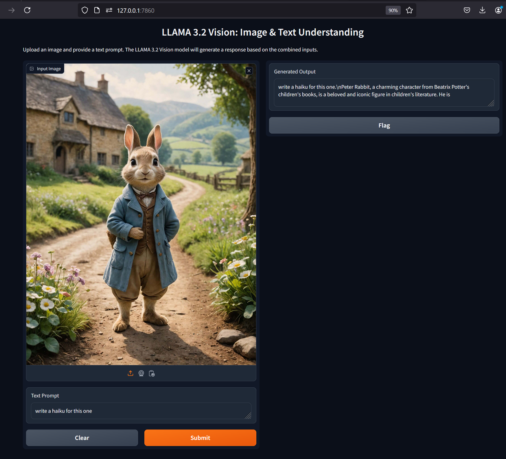

---

# LLAMA 3.2 Vision: Image & Text Understanding


<p align="center">
  Depth-Anything-V1
  
</p>
This project uses the LLAMA 3.2 Vision model to generate text responses based on image inputs and accompanying text prompts. It utilizes the Gradio library to create a user-friendly interface for interaction.

## Requirements

Make sure you have the following dependencies installed:

- Python 3.7 or later
- `gradio`
- `torch`
- `Pillow`
- `transformers`
- `huggingface_hub`

You can install these dependencies using pip:

```bash
pip install gradio torch Pillow transformers huggingface_hub
```

## Getting Started

### Hugging Face Token

To use the model, you'll need a Hugging Face account and a token. Follow these steps:

1. Sign up for a Hugging Face account [here](https://huggingface.co/join).
2. Obtain your access token from [your settings](https://huggingface.co/settings/tokens).

### Setting Up the Project

1. Clone this repository:

    ```bash
    git clone https://github.com/yourusername/llama-vision.git
    cd llama-vision
    ```

2. Replace `"Put Your Hugging Face Token"` in main.py with your actual Hugging Face token.

### Running the Application

To run the Gradio interface, execute the following command:

```bash
python main.py
```

This will launch a web interface where you can upload an image and provide a text prompt. The LLAMA 3.2 Vision model will generate a response based on the combined inputs.

## Code Overview

The main components of the code are as follows:

- **login_huggingface(token: str)**: Authenticates the user with Hugging Face using the provided token.
- **load_model_and_processor(model_id: str)**: Loads the LLAMA model and processor from Hugging Face.
- **process_input(image: Image.Image, text_input: str) -> str**: Processes the input image and text prompt to generate a response from the model.

### Main Execution

The main block of the script handles the following tasks:

1. Logs into Hugging Face using the provided token.
2. Loads the model and processor.
3. Sets up the Gradio interface to allow user input.

## Usage

1. Upload an image.
2. Enter a text prompt.
3. Click "Submit" to receive a generated response based on the image and text.

## License

This project is licensed under the MIT License. See the [LICENSE](LICENSE) file for details.

## Acknowledgments

- [Gradio](https://gradio.app/) for providing the interface.
- [Transformers](https://huggingface.co/docs/transformers/index) for the model and processor.
- [Hugging Face Hub](https://huggingface.co/) for hosting models.

---

Feel free to modify any sections to better fit your project or personal style!
